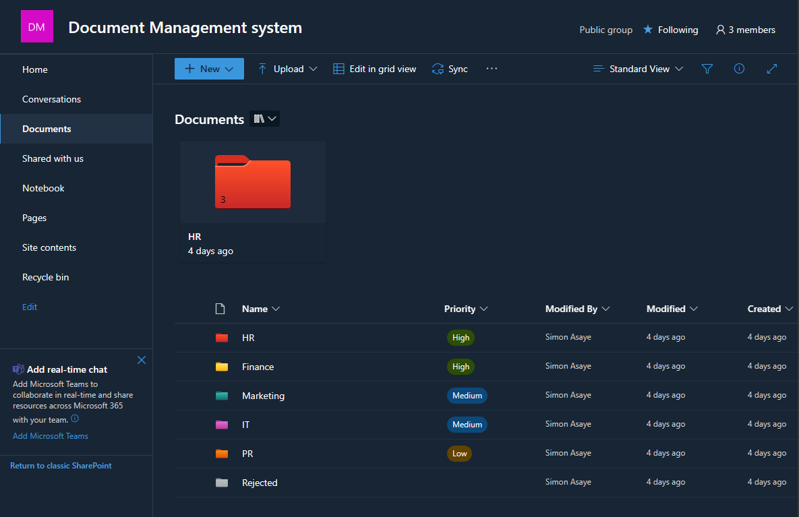

# 📁 Document Management System for SharePoint

## 🌟 Overview

Welcome to our Document Management System (DMS) project for SharePoint! 🚀 Our system is designed to enhance efficiency in document organization, version control, approval workflows, and much more. It's tailored for businesses seeking robust solutions in metadata management, user access control, and security within the SharePoint environment.

## 📚 Features

### 📂 Document Library Organization

#### 1. Logical Folders and Subfolders
Organize documents effectively based on content type, department, or other criteria.

#### 2. Views
- **Standard View**: Display documents in a list format with customizable columns like title, author, date created, etc.
- **Group by View**: Group documents by specific columns for quick access to related documents.
- **Calendar View**: Visualize documents as events, perfect for deadlines or date-sensitive documents.

#### 3. Filters
- **Basic Filters**: Filter documents by creation date, modified date, author, etc.
- **Metadata Filters**: Use custom metadata for advanced filtering.

### 🔒 Version Control and Approval Workflows

#### 1. Version Control
Efficiently track changes and revert to previous versions when necessary.

#### 2. Approval Workflows
Set up workflows for proper review and authorization of documents.

### 🏷 Metadata Management

#### 1. Custom Metadata Columns
Create columns to capture information relevant to your documents (e.g., Department, keywords).

#### 2. Document Status and Workflow Integration
Automate document status based on the outcomes of approval workflows.

### 👥 User Access and Security

#### 1. Permissions
Control access with specific permissions (read, write, delete, upload, manage) and group users based on roles.

### 📊 Auditing and Logging
Maintain a secure environment with mechanisms to track user actions within SharePoint.
## Check the video for more 

 
### Lets Connect 

