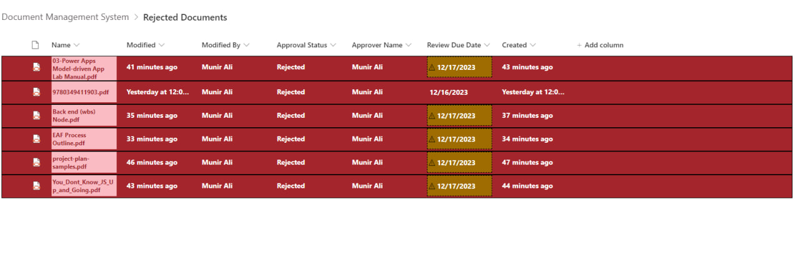

# Awesome Document Management System

## Project Overview

🚀 Welcome to our Document Management System (DMS) project, where excellence meets efficiency! 🚀

### What I added To The project 

**1. JSON Magic for Views**
-For Standard View (All Documents)
-For Calendar View 
-For Approved By View
-For Gallery View

**2. Gallery Bliss with Tile View**

Indulge in a visually stunning Gallery Tile View that turns your document library into a masterpiece. A modern twist for a classic necessity.

**3. Standard View, Leveled Up**

Behold the Standard View, not as you know it!  meticulous CSS styling adds flair and finesse to your document listings.

## Workflow Wizardry

**1. Move to "Rejected Documents" - Like Magic!**

my first Recurrence Workflow gracefully sweeps rejected documents away to a secret garden called "Rejected Documents." Organized and stress-free.

**2. Declutter with Document Deletion**

Witness the second Recurrence Workflow working silently in the background, deleting aged, rejected documents after 7 days. A tidy space is a happy space.

**3. Approval Workflow Extravaganza**

Raise the curtain for  integrated Approval Workflow, a choreography of systematic document reviews and authorizations.

**4.** Meta Data Mastery** **

Take control with custom metadata columns capturing document intricacies:

## Fort Knox Security - Low-Level Permissions

Forge a fortress around your documents! I've customized low-level permissions, cutting ties with site inheritance for a tailored, secure experience.

## Project Images 
****

## Portfolio Playground

Dive deeper into our creative universe! [Explore our portfolio](link_to_portfolio) for more wonders.

🎉 Thank you for choosing our Awesome Document Management System! Your journey to document nirvana begins here. For questions or applause, reach out to us anytime. Happy managing! 🎉

## Connect with us:

- LinkedIn: [Code Point Creatives](https://www.linkedin.com/company/codepoint-creatives/mycompany/)
- Website: [Code Point Creatives](https://codepointcreatives.com/)

Let's build something amazing!

